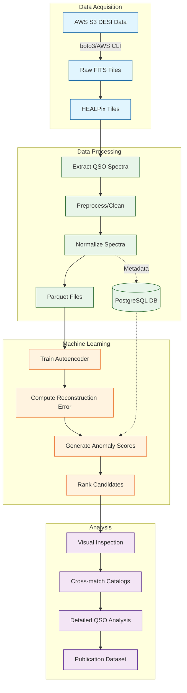

# DESI-QAD: Quasar Anomaly Detection

## Overview

DESI-QAD is a machine learning project that uses unsupervised anomaly detection to identify unusual quasar spectra within the Dark Energy Spectroscopic Instrument (DESI) Data Release 1. By leveraging autoencoder architectures, we aim to discover statistical outliers that may represent rare physical phenomena, unusual accretion physics, or potentially new classes of astronomical objects.

[](https://opensource.org/licenses/MIT)


## Scientific Motivation

While the average quasar spectrum is well-understood, the full diversity of these objects remains an active area of research. Outliers in large spectral surveys can reveal:

- Quasars with extreme physical properties (unusual accretion rates, metallicities, outflow characteristics)
- Rare evolutionary phases or transient events captured spectroscopically
- Objects with complex line-of-sight absorption or dust reddening
- Potentially misclassified objects or entirely new astronomical source types

Systematically identifying these anomalies in DESI DR1 provides a valuable sample for follow-up study and deeper astrophysical understanding.

## Dataset

- **Primary Source**: [DESI Data Release 1 (DR1)](https://data.desi.lbl.gov/doc/releases/dr1/)
- **Target Sample**: ~1.6 million objects classified as Quasars (`SPECTYPE == 'QSO'`) with high-confidence redshifts (`ZWARN == 0`)
- **Data Access**: AWS Open Data Program S3 bucket (`desidata`) using AWS CLI / Python `boto3`
- **Estimated Volume**: Low single-digit Terabyte range

## Pipeline Architecture



### 1. Data Acquisition

- Python-based ETL pipeline for downloading and processing DESI HEALPix tiles
- Targets specific files (`coadd-*.fits`, `redrock-*.fits`) containing quasar data
- AWS S3 access via `boto3` with clean resumable download capability

### 2. Data Processing

- Extract quasar spectra and metadata from FITS files
- Preprocess spectra (masking, normalization, interpolation to common wavelength grid)
- Store processed data in Parquet format for efficient ML access
- Track metadata in PostgreSQL database for querying and analysis

### 3. Anomaly Detection

- Implement autoencoder/variational autoencoder in TensorFlow/PyTorch
- Train on majority of spectra to learn "normal" spectral features
- Calculate reconstruction error as anomaly score
- Rank spectra by anomaly score to identify outliers

### 4. Analysis & Validation

- Visually inspect top candidates
- Cross-match with external catalogs (photometry, radio, X-ray)
- Analyze redrock fit details and emission line measurements
- Document unusual objects for potential follow-up

## Infrastructure

This project runs on the [Proxmox Astronomy Lab](https://github.com/VintageDon/proxmox-astronomy-lab) infrastructure:

- **Compute**: RKE2 Kubernetes cluster (5 nodes) for ETL processing
- **GPU**: NVIDIA RTX A4000 (16GB VRAM) for model training
- **Storage**: Tiered (NVMe + ZFS) with ~40TB total capacity
- **Database**: PostgreSQL for metadata indexing and querying
- **Networking**: 10GbE internal network for efficient data movement

## Getting Started

### Prerequisites

- Python 3.9+
- Access to DESI DR1 data (via AWS Open Data Program)
- Required libraries: `astropy`, `numpy`, `pandas`, `h5py`, `pyarrow`, `tensorflow`/`pytorch`

### Installation

```bash
# Clone the repository
git clone https://github.com/VintageDon/desi-qad.git
cd desi-qad

# Set up Python environment
python -m venv venv
source venv/bin/activate  # On Windows: venv\Scripts\activate
pip install -r requirements.txt
```

### Basic Usage

```bash
# Configure data paths in config.json
# Run the data extraction pipeline
python scripts/extract_qso_tiles.py

# Train the autoencoder model
python models/train_autoencoder.py

# Generate anomaly scores
python analysis/score_spectra.py

# Analyze top candidates
python analysis/analyze_candidates.py
```

See the [documentation](docs/README.md) for detailed instructions and examples.

## Code Examples

### Extract QSO Spectra from DESI Tiles

```python
from desi_qad.extraction import extract_qso_tile_to_parquet

# Process a single HEALPix tile
extract_qso_tile_to_parquet(
    data_dir="/path/to/healpix/0/0", 
    output_dir="/path/to/output",
    min_wave=3600,
    max_wave=9800
)
```

### Train Autoencoder Model

```python
from desi_qad.models import QSOAutoencoder

# Initialize and train the model
model = QSOAutoencoder(
    input_dim=1000,  # Number of spectral points
    encoding_dim=32,  # Size of latent space
    hidden_layers=[512, 256, 128, 64]
)

model.train(
    data_path="data/processed/qso_spectra.parquet",
    batch_size=64,
    epochs=100
)
```

## Project Status

- [x] Initial planning & feasibility assessment
- [x] Dataset identification (DESI DR1 Quasars)
- [x] Data access method selection (AWS S3 Open Data)
- [x] ETL strategy definition
- [x] Initial ML model selection (Autoencoder/VAE)
- [x] S3 download script development
- [ ] ETL pipeline implementation (In Progress)
- [ ] ML model implementation & training
- [ ] Candidate validation & analysis
- [ ] Publication preparation

## Contributing

Contributions are welcome! Please feel free to submit a Pull Request. For major changes, please open an issue first to discuss what you would like to change.

See [CONTRIBUTING.md](CONTRIBUTING.md) for details on our code of conduct and contribution process.

## License

This project is licensed under the MIT License - see the [LICENSE](LICENSE) file for details.

## Acknowledgments

- Dark Energy Spectroscopic Instrument (DESI) collaboration for making DR1 publicly available
- AWS Open Data Program for hosting the DESI data
- [Proxmox Astronomy Lab](https://github.com/VintageDon/proxmox-astronomy-lab) for research infrastructure

## Citation

If you use this code or methodology in your research, please cite:

```
@software{desi_qad_2025,
  author = {VintageDon},
  title = {DESI-QAD: Quasar Anomaly Detection},
  url = {https://github.com/VintageDon/desi-qad},
  year = {2025},
}
```

## Contact

Project Lead - VintageDon - [GitHub](https://github.com/VintageDon)
